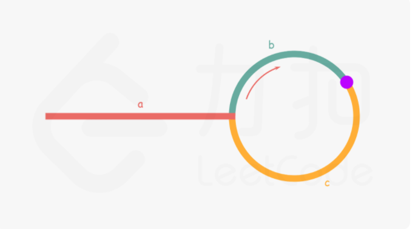

# 一、个人习惯

1. 自定义的右指针right能包含就包含

2. 如果难理解的边界条件，尽量使用<= n - 1，而不是< n

3. 自定义的第k大，习惯于都以1开始

4. 若第k大以1开始，则
   
   
   $$
   \text{奇数length数组的中位数所在的k} = (length + 1)/2 \\
   \text{偶数length数组的中位数所在的k} = ((length / 2) + (length / 2) + 1) /2.0
   $$
   
5. 中文英文语义里的第几个默认从1开始

6. 谨记，题目所给的是没有哑结点的，所以要加个防止删除第一个节点（即头节点）无法回收空间

7. 若right不含本数，i<(right + left)/2即可遍历中值（不含）往左的所有数 

   mid在含和不含思考方式：取3和4，分别求证

8. 二分查找while(left <= right)

# 二、经验总结

#### 回溯法

- 对于**寻找所有可能解**的题，都可以尝试使用回溯法
- 回溯法搜索时使用的是dfs
- 可以尝试剪枝加快运行
- 如17题、39题

#### **栈**

- 缓存数据**从左往右**--->
- 计算出一个结果的顺序是**从右往左**<---
- 并且**计算完成以后我们就不再需要了**,符合先进先出的特点

#### 滑动窗口

- 关键词：**最长连续**之类的词...（下一个left时，从left到right显然是符合题意的）
- 需要有判定条件：当right右移到什么程度是
- 其实是特殊的双指针

#### 树

- 树很多都用递归的方法解

#### 位图

- 位图数据结构只需要1/8的空间，节省7/8的内存是非常可观的。

- 设有char类型数x，1字节包括8个位，我们可以**申请char bit_map[10亿/8+1]的空间**

- set_bit(char x, int n); //将x的第n位置1，可以通过  **x |= (1 << n)**  来实现

- clr_bit(char x, int n); //将x的第n位清0，可以通过  **x &= ~(1 << n)** 来实现

- get_bit(char x, int n); //取出x的第n位的值，可以通过 **(x >> n) & 1** 来实现

- 比如，要对数字int x = 1848105做标记，就可以调用`set_bit(bit_map[x/8], x%8);`

  除法看做求“组编号”，x/8即是 以8个位为一个小组，分组到编号为**idx = x/8**的bit_map元素中，然后在组内偏移**lft = x%8**个比特位。

  可以把**x/8**改为**x>>3**，**x%8**改为**x&7**以减小开销

#### 排序

- **快排**：单指针快排、双指针快排

```c++
      int single_quicksort(vector<int>& nums, int left, int right) {
          int pivot = nums[left];
          int i = left; // left这个index上的数在遍历时不会动
          int j = left + 1; // 注意
          while (j <= right) {
              if (nums[j] < pivot) {
                  i++; // 注意
                  swap(nums[i], nums[j]);
              }
              j++; //注意
          }
          swap(nums[i], nums[left]); // 注意
          return i;
      }
  
      int double_quicksort(vector<int>& nums, int left, int right) {
          int pivot = nums[left];
          int i = left;
          int j = right;
          while (i < j) { // 注意是 <
              while (i < j && nums[i] <= pivot) {
                  i++;
              }
              while (i < j && nums[j] >= pivot) {
                  j--;
              }
              if (i < j) {
                  swap(nums[i], nums[j]);
              }
          }
          return i;
      }
```

- **归并排序**：必须要会

# 二、题目

#### 234. 回文链表

#### 41. 缺失的第一个正整数

- (1) 将数组改造成**哈希表**
- (2) 或者把`num[i]`和`num[num[i] - 1]`交换 （前提是二者不等）

- 对于一个长度为 NN 的数组，其中**没有出现的最小正整数只能在\[1, N+1]中**。这是因为如果 \[1, N]都出现了，那么答案是 N+1，否则答案是 \[1, N]中没有出现的最小正整数。

#### 221. 最大正方形

- **动态规划**：dp\[i][j]表示以坐标点(i,j) 为右下角的最大正方形的边长
- 与 85题最大矩形 不同，最大矩形那题 用单调栈（+动态规划）
- dp\[i][j] = min（左，上，左上）
- 注意返回值是所有dp\[i][j]里的最大值

#### 208. 前缀树

- Trie就是一个节点，不需要额外创建节点！
- 每个节点存储`bool isEnd`，`Trie* next[26]`，(因为题目说节点值只会是26个字母)
- 初始化时`memset(next, 0, sizeof(next));`
- insert、search、startWith的初始节点都设置为`Trie* node = this;`

#### 215. 数组中的第K个最大元素

- **经典高频面试题！多练！**
- **快排**找到的pivot左侧都比pivot小(or等)，右侧都比pivot大(or等)
- 第k大元素，第k小元素----->**通通换成求index为right - k + 1的元素**
- 直接在原数组上排序
- 要额外写3个函数：
  - `single_quicksort`：单(双)指针快排返回index
  - `random_quicksort`：用`(rand()% (right-left+1)) + left`随机取数、与left交换
  - `k_quicksort`：调用`random_quicksort`得到pivot，比较pivot与rank的大小，将自身递归
- 注意调用随机函数时要先用`srand((unsigned)time(NULL));` 初始化种子

#### 206. 反转链表

- (1)迭代。不需要dummyNode。每次记录前一个节点

- (2)递归。比较难！每层递归返回的都是那最后一个节点

#### 207. 课程表

- 拓扑排序，即广度优先搜索。必须要会！

#### 200. 岛屿数量

- 水0和陆地1组成的二维矩阵，岛屿总被水包围，假设矩阵四周被水包围，计算岛屿数量
- 没找到一块陆地就将它设置为0
- (1) 深度优先搜索
- (2) 广度优先搜索，使用queue

#### 198. 打家劫舍

- 相邻房屋被偷会报警，求能偷取的最大金额
- 经典动态规划 `dp[i] = max(dp[i - 1], dp[i - 2] + nums[i]);`

#### 169. 相交元素

- 找数组里大于`⌊ n/2 ⌋` 的那个元素。

- 数学：Boyer-Moore 投票算法
  - 如果候选人不是major，则 major 会和其他非候选人一起反对，所以候选人一定会下台(sum==0时发生换届选举)
  - 如果候选人是major，则major会支持自己，其他候选人会反对，但因为major票数超过一半，所以major一定会成功当选

#### 160. 相交链表

- 要求O(*n*) 时间复杂度，且仅用 O(*1*) 内存
- 第一反应哈希表，但内存是O(N)
- 所以使用双指针，当pa/pb到达末尾时，将pa和pb分别重定位到pb和pa，最终pa和pb相遇的点即是相交点。

#### 155. 最小栈

- 设计一个支持 `push` ，`pop` ，`top` 操作，并能在常数时间内检索到最小元素的栈。
- **辅助栈**，用于存储放入某一元素时栈的最小值。初始时放入INT_MAX，min_stack的push和pops时，辅助栈也跟着push和pop

#### 152. 乘积最大子数组

- **动态规划**
- 设置两个动态规划数组
  - dp1[i]表示到数字nums[i]的**最大**乘积
  - dp2[i]表示到数字nums[i]的**最小**乘积
  - 每次遍历计算出nums[i] * dp2[i - 1]和nums[i] * dp2[i - 1]

#### 148. 排序链表

- 要求O(nLogn)的时间复杂度和O(1)的空间复杂度
- **自底向上归并排序**

#### 142. 环形链表Ⅱ

- 与第141环形链表Ⅰ不同的是，要求返回开始入环的第一个节点(被指向的那个节点，入环点)

- 空间复杂度要求O(1)且不允许修改给定的链表。

- 仍然是**快慢指针 + 数学题**

- $$
  a=c+(n−1)(b+c) \\
  \text{	其中a是head到入环点的距离，c是slow到入环点的距离，当ptr(=head，init)与slow相遇时即是入口点}
  $$

- 

- 与第141环形链表Ⅰ不同的是，fast和slow这次都从head开始

#### 141. 环形链表Ⅰ

- 判断链表中是否有环

- 要求用O(1)的空间复杂度，则使用**快慢指针**
  - 慢指针只走1步，快指针走2步，快指针在前，慢指针在后
  - while的盘定条件时快慢指针重合
  - 因此慢指针从head开始，快指针从head->next开始。
  - 可以理解为head前有一个虚拟节点，慢指针走一步到head，快指针走两步到head->next
- 若不要求O(1)的空间复杂度，则可使用哈希表O(N)
- 时间复杂度都是O(N)

#### 139. 单词划分

- **动态规划**：`vector<int> dp(n + 1); // 从0开始，子串s[0: i - 1]能否被划分`

#### 136. 只出现一次的数字

- 非空整数数组里除了一个元素，其他的元素都出现了两次，找出这个元素
- 要求时间复杂度O(N)，不适用额外空间
- **位运算**，全部元素 异或(^) 运算的结果就是只出现一次的那个元素

#### 128. 最长连续序列

- 未排序数组nums中找出数字连续的最长序列（不要求数字在原数组中连续）
- 要求时间复杂度O(N)
- 使用**哈希集合unordered_set**
- **用于学习如何在unordered_set中查找连续的元素**，注意代码的书写
- 好题！

#### 124. 二叉树中的最大路径和

- **递归**
- 每个节点的路径贡献=该节点的值+max（左子节点贡献值，右子节点贡献值） // 因为每一个节点只能选要么左边要么右边一条路径！（相当于当前节点作为连接点）
- 设置全局路径和ans=INT_MIN，遍历每个节点时，ans与（val+左子节点贡献值+右子节点贡献值）作比较，ans取两者较大值。（相当于当前节点作为非连接点的普通贡献点）
- 注意，因为节点值可能负数，只有子节点(分支)的贡献度大于等于0才选择该分支，不然还不如不选该分支。

- 好题！
- 每次递归如果需要共享一个变量，该变量通常可以设置全局变量

#### 121. 买卖股票的最佳时机

- 只能购买一次
- 也不需要动态规划，一次遍历即可，每次遍历更新min_price，并且更新答案max_profit = price - min_price即可

#### 114. 二叉树展开成单链表

- (1) 使用前序遍历即可。但不能一边遍历一边把节点连成链表，需要先用vector存储。否则设置node->right时会丢失节点原先的右子树
- (2) 一边遍历一边把节点连成链表不用vector的前序遍历做法：将右、左节点(非空)先后入栈
- (3) 另有一个寻找前驱节点的O(N)、O(1)的做法，纯指针操作，较难想到

#### 102. 二叉树的层次遍历

- **广度优先搜索**

#### 101. 对称二叉树

- 递归
- 使用 队列 进行迭代

#### 98. 验证二叉搜索树

- (1) 递归

- (2) 中序遍历：二叉搜索树的中序遍历一定是严格递增的，所以在中序遍历时检查是否满足条件

- 注意int范围是 -2147483648 ----- 2147483647，所以被比较的value的初始值要设置为

  `long long lastVal = (long long)INT_MIN - 1;`

#### 96. 不同的二叉搜索树

- **动态规划**

- 只要一维数组，但要两层循环，时间复杂度O(N)

- 定义俩个函数：

  - G(n)：表示长度为 n 的序列能构成的不同二叉搜索树的个数。
  - F(i, n)：表示以 i为根、序列长度为 n 的不同二叉搜索树个数 (1≤*i*≤*n*)。

- $$
  G(n) = \sum^n_{i = 1}F(i, n) = \sum^n_{i=1}G(i-1)\times G(n-i) \text{	// 从小计算G(i)即可，O(N^2)}
  $$

- 

#### 146. LRU缓存机制

- **哈希表+手写双向链表**，哈希和双向链表相关联。和我们的LRU的Golang项目一样！
- 记得双向链表使用两个哑结点head和tail
- 需要实现四个函数：
  - 增加，一定是增加到头部！addToHead
  - 删除，就地删除！removeNode
  - 移动到头部，由于使用了一次，需要将该节点移动到头部，是removeNode和addToHead的结合
  - 空间超出，删除结尾节点，返回该节点，调用removeNode。由于需要删除哈希表里的该值，因此需要返回该节点。
- 关于C++类成员变量初始化问题：
  - (1) 成员变量在使用**初始化列表初始化**时，与构造函数中初始化成员列表的顺序**无关**，只与**定义成员变量的顺序有关**。
  - (2) 如果**不使用**初始化列表初始化，在构造函数内初始化时，此时与成员变量在构造函数中的位置有关。
  - 注意：类成员在定义时，是不能初始化的
  - 注意：类中const成员常量必须在构造函数初始化列表中初始化。

#### 剑指07. 根据前序中序遍历重建二叉树

- 递归法

  - 四个index(都含本数)， pre_left, pre_right, mid_left, mid_right。注意递归时传参应该传的值！
  - 中序遍历的根节点左侧有num节点，前序遍历从该root开始的num个节点就有且仅有都在root的左侧
  - 使用map存储value对应的inorder的坐标

- 迭代法

  - 使用**栈**存储尚未考虑其右节点的节点。若栈直接pop了而没有设置其右节点，则代表其没有右节点。
  - 栈遍历pre前序数组，另有一个**index**遍历mid中序数组。若栈顶元素是index，则将当前i节点放在index所指接节点的右节点
  - (1)我们用一个栈和一个指针辅助进行二叉树的构造。初始时栈中存放了根节点（前序遍历的第一个节点），指针指向中序遍历的第一个节点；
  - (2)我们依次枚举前序遍历中除了第一个节点以外的每个节点。如果 index 恰好指向栈顶节点，那么我们不断地弹出栈顶节点并向右移动 index，并将当前节点作为最后一个弹出的节点的右儿子；如果 index 和栈顶节点不同，我们将当前节点作为栈顶节点的左儿子；

  - (3)无论是哪一种情况，我们最后都将当前的节点入栈。

#### 94. 二叉树的中序遍历

- 需要复习

- 递归法回溯dfs很简单
- 使用迭代法，O(N), O(N)
- 另外还有Morris中序遍历，O(N), O(1)

#### 85. 最大矩形

- **单调栈**，是 第84题柱状图中最大的矩形 的扩展，可以结合着一起复习！
- 用二维数组left\[i][j]记录元素(i, j)所在行左侧(包含)的连续的1的数量，用**动态规划**完成
- 对二维数组里每个元素，秋同列上最大宽度，即每一列都是倒下的84题的柱状图

#### 84. 柱状图中最大的矩形

- **单调栈**
- **熟悉单调栈的好题！多做几遍！**
- 栈存放坐标
- 用两个vector存储每一位的左边界坐标和右边界坐标
- 左右边界都不包含本数
- (1) 用两个单调栈，两次遍历，一个求出左边界，一个求出右边界
- (2) 用一个单调栈，一次遍历，出栈得到栈中每个元素的右边界是i，入栈得到当前heights[i]的左边界是(stack).top() （或-1）
- 第(2)种方法里出栈判断条件是<=的影响:
  - 如果有若干个柱子的高度都等于矩形的高度
  - 即便前面几根等高的柱子无法求出正确边界
  - 但最右侧的那根柱子是可以求出正确的右边界的

#### 79. 单词搜索

- 回溯法

#### 78. 子集

- (1) 回溯
- (2) **位运算**：每一个数字的选与不选，都相当于一个01序列。总共n个数字就相当于长度为n的01序列。**本题可以用来练习位运算！**
- `mask & (1 << i)` 即mask的第i位

#### 76. 最小覆盖子串

- **滑动窗口**！
- 经典滑动窗口题。**有很多细节，可以锻炼滑动窗口的书写，是很好的一题！**

#### 75. 颜色分类

- 双指针：(1)可以都从左侧开始的p0，p1  (2)也可以一个从左侧即p0，一个从右侧即p2
- 下列说明的是（2）左右双指针的方法：
- 注意i只需要遍历到p2的位置
- 注意要先判断2再判断0，因为在p2时换过后的nums[i]可能是0，若对调顺序就错过了
- 本体最重要的是指针的移动：因为遍历是从左到右的，和p0交换后没关系后续随p0的移动此时的nums[i]还会被遍历到。但和p2交换时，被交换后的nums[i]（原本p2所指的未知的值）还有可能是2，因为p2是从右到左的，所以到下个循环我们讨论的是nums[i+1]而nums[i]不再被考虑，而这个2被错误的忽视了！
- 所以当我们找到 2 时，我们需要**不断**地将nums[i]（i不动）与新的nums[p2]（p2动）进行交换

#### 72. 编辑距离

- 经典动态规划
- 记得只用两个数组来优化，而不是使用占用空间很大的dp二维矩阵
- **有很多细节需要注意，很值得多做几次！**

#### 64. 最小路径和

- 是 第62题不同路径 的扩展，显然动态规划

#### 62. 不同路径

- 思路: 动态规划！

- (1) **动态规划**！`dp[i][j] = dp[i - 1][j] + dp[i][j - 1]`

- (2) 组合数学C_{m+n-2}^{m-1}：总共要走m-1+n-1步，在这m+n-2步里挑m-1步向下

  注意不能ans *= top / bottom; 而应该分开写成ans *= top; ans /= bottom;

#### 56. 合并区间

- 思路：根据每个数组的第一个元素对intervals进行排序
- 若ans为空，或当前interval左区间大于ans.back()的右区间，直接将当前interval插入ans
- 否则改变ans.back()的右区间为原先右区间与当前interval右区间的最大值

#### 55. 跳跃游戏

- 贪心算法。课上讲过

#### 53. 最大子序和

- 思路：动态规划

- dp[i]：以nums[i]结尾的的连续子数组的和

- 返回所有dp[i]里的最大值

#### 49. 字母异位分组

- 思路：哈希，键可以有两种：

- (1) 排序好了的string
- (2) 相同构成的string的字母出现次数是一样的，所以key是一个统计26个字母次数的array

#### 48. 旋转图像

- 要求原地翻转

- 数学题
- 顺时针旋转90° == 水平翻转+左上到右下的对称轴翻转 == 竖直翻转+右上到左下的对称轴翻转 
- 注意：水平翻转只遍历一半的数据，所以上述两式不能合并
- 注意: 水平翻转(i < n/2) 和 对角线翻转(j<i) 的遍历条件！！

#### 46. 全排列

- 典型**回溯法**
- **好方法：**需要记录哪些元素用过。为了节省空间，用swap(元素1，元素2)将用过的元素都放到前面。

#### 42. 接雨水

- 经典题！
- (1)动态编程O(N),O(N)：和暴力法差不多，只是用两个数组记录下左遍历和右遍历的最大值：对每个桩，查找往左侧望过去最高的桩，往右侧望过去最高的桩
- (2)**栈**O(N),O(N)：横向看来计算水量。当当前高度比栈顶小就入栈，若大就出栈，计算高度和距离
- (3)**双指针O(N),O(1)**：是动态编程的优化。发现某个桩能装水的量只由左边或右边最小的那个值界定，所以每次只移动较小的那个指针：若比记录的max大，则更新max，否则计算水量。总共遍历一次就行了，且只需要常数空间。

#### 39. 无重复数组里所有和为target的组合

- 回溯法

#### 34. 在排序数组中查找元素的第一个和最后一个位置

- 思路：二分查找

- leftIdx第一个大于等于target的下标

- rightIdx第一个大于target的下标-1

- 还要判断是否leftIdx和rightIdx所指的元素是否是target，否则返回[-1, -1]

#### 33. 搜索旋转排序数组

- **二分查找**
- 二分查找不需要递归！归并排序才需要递归！虽然二者都使用了left、mid、right。二分查找经常用在已经排好序的数组中
- 本题是很好的题！没用什么难的算法，但很考验编程能力和细节

#### 32. 最长有效括号

- 本题较难

- 有三种方法：动态规划、栈、正反逆向遍历
- 可以用动态规划做。后两种比较难想到

#### 31. 下一个排列

- 数学题

- （1）从右侧往左找到第一个山峰

  （2）从右往左找到山峰右侧中第一个比nums[i]小的数

  （3）交换，可以确保山峰右侧仍是递减的

  （4）把山峰右侧翻转成递增

#### 23. 合并K个升序链表

- **归并排序**：定义（1）merge两个ListNode的函数，即正常的链表操作 （2）对一堆ListNodes进行二分排序，参数是lists、left、right（含本数）、mid

#### 18. 删除链表的倒数第N个节点

- 要求一趟扫描，删除链表的倒数第 `n` 个结点，并且返回链表的头结点。
- 谨记，题目所给的是没有哑结点的，所以要加个防止删除头节点时无法回收空间

#### 17. 电话号码的字母组合

- **回溯**

#### 15. 三数之和

- b变大后，c肯定变小

- **排序+双指针**
- 双指针：如果一个元素的递增，必将造成另一个元素的递减，就可以用双指针。这样的话时间复杂度将从O(N^2)讲到O(N)

#### 11. 盛最多水的容器

- 经典**双指针问题**
- 双指针问题：每次将一个指针往另一个指针的方向移动
- 每次只移动那个矮一点的指针，因为这个指针如果再作为边界容量肯定更小

#### 10. 正则表达式匹配

- **动态规划**
- 若是*，则有2种情况：（1）匹配0个前面的字符，将该组合扔掉（2）匹配至少一个字符，将s中该末尾字符扔掉，组合还可以继续匹配
- 注意match的书写，要判断p[j]=='.'的情况。而且若i==0，则输出false

#### 5. 最长回文子串

- 经典三种方法：**动态规划**、**中心扩散法**、**马拉车算法**

- 中心扩散法，遍历，对每个i调用`palindromeAroundCenter(s, i, i)`;和`palindromeAroundCenter(s, i, i + 1);`
- (string).substr(起始的i，不含本数的长度）

#### 4. 寻找两个正序数组的中位数

- **寻找两个数组的第k小元素的变种**
- **本题非常有助于思考第k大和+1 -1的边界条件**

#### 3. 无重复字符的最长字串

- **滑动窗口**：关键词：**最长连续**之类的词...（下一个left时，从left到right显然是符合题意的）
- `(unordered_set).insert(elem)`: 从set里增加一个元素
- `(unordered_set).erase(elem)`: 从set里删除一个元素
- `(unordered_set).count(elem)`: 从set里查找一个元素的数量

#### 2. 两数相加

- 题目参数的ListNode没有头节点
- 若不需要在开头插入节点，则可以不用头节点
- 使用两个指针：头指针head和尾指针tail，便于往后添加节点
- 可以直接改变输入的指针，即`l1 = l1 -> next`

#### 1. 两数之和

- 使用unordered_map加快搜索
- `(unordered_map).find(elem)` 从map里查找元素，返回的是一个iterator，使用(iterator)->first和(iterator)->second访问键和值。找不到的话返回(map).end(）
- `(unordered_map).count(elem)` 返回的直接就是数字，更直观
- 返回vector可以直接用return {elem1，elem2};

#### 239. 滑动窗口最大值

双端队列deque，有push_back和pop_back。单调队列的 push 方法依然在队尾添加元素，但是要把前面比新元素小的元素都删掉，在维护单调栈的时候用的是元素下标，而非元素实际的值，就是为了判断栈顶何时出栈（当窗口左端已经pass栈顶下标的时候）。单调栈的典型用途是用于找到数组中下一个比自身大的元素（the next greater element, NGE），可以在一次遍历就获得所有元素的NGE。907，739，503类似


# 三、C++常用方法

1. ```c++
   unordered_map<int,int> mp；//
   ```

2. ```c++
   sort(nums.begin(),nums.end());//进行排序
   ```

3. ```c++
   ListNode head, *tail = &head;//使用头节点
   return head.next;
   ```
   
4. ```c++
   (vector).emplace_back(数据); 不采用拷贝构造函数，直接插入，比push_back更快。适用于往二维数组里插入数组
   ```

5. ```c++
   array<int, 26>在初始化时必须指定大小，并且
   ```

6. ```c++
   map.erase(key) // 删除map里key对应的entry
   ```

7. ```c++
   (unordered_set).insert(数据) // 往哈希集合插入数据
   (unordered_set).count(数据) // 查找数据
   ```

8. ```c++
   // C++使用随机数,如第215题数组中第K大元素
   srand((unsigned)time(NULL));
   使用时用rand() % (区间长度)
   ```

9. 

# 四、Go常用方法

1. Go没有堆栈队列，需要自己用slice实现